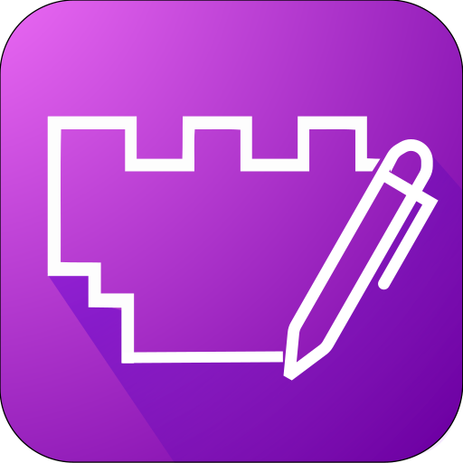

<p align=center></p>
<h1 align=center>Open Witness Library</h1>

<p align=center><b>Open Witness Library</b> is a program to read articles that carries <i>God's true name</i>.</p>

## Warning
This branch is outdated, please refer to the most [recent branch](https://github.com/orangethewell/open-witness-library/tree/ui-development).
---
This program is a alternative for **JW Library** app[^1] for OSes that doesn't support the app or had lost support through the years. You can read `.jwpub` files and study Bible.

## Features

This program still is a work-in-progress, so it isn't full compatible with all publications and publication's features. You can track the features present on the program there:

- [ ] Publications:
    - [x] Read the publications;
    - [ ] Aswner the publication questions on textboxes;
    - [ ] Highlight publication text;
    - [ ] Make notes;
    - [ ] Watch publication's videos;
- [ ] Bible:
    - [ ] Read Bible; `You can read partially Bible's content`
    - [ ] Bookmark Bible versicles and chapters;
    - [ ] Read from Publications;
    - [ ] Compare multiple Bible editions;


## Installation

See [Building](#building) for more information.

## Building
For testing the app, you need to setup a *Rust* development environment on your operational system. After installing every depedency and following the prerequisites below, you should install [Rustup](https://rustup.rs/) through the official site or from your package manager and download the latest Rust language version. 

### Windows
For Windows, see [Windows prerequisites](https://next--tauri.netlify.app/next/guides/getting-started/prerequisites/windows). 

### MacOS
For MacOS, you will need to install **CLang** and *MacOS development dependencies*. To do this, run the following command in your terminal:
```sh
$ xcode-select --install
```

### Linux
For Linux, you will need to install some packages in order to work, see the instruction on how to install based in your [Linux distro](https://next--tauri.netlify.app/next/guides/getting-started/prerequisites/linux#1-system-dependencies).


### WASM UI setup
After installing the depedencies, you'll need to setup Cargo for compiling the application 
UI and serving it locally. To do it, install Trunk *via Cargo*:

```sh
cargo install --locked trunk
# Until wasm-bindgen has pre-built binaries for Apple M1, 
# M1 users will need to install wasm-bindgen manually.
cargo install --locked wasm-bindgen-cli
```

and add `wasm32-unknown-unknown` target to your rustup installation:
```sh
rustup target add wasm32-unknown-unknown
```

### Running the application
To run the application you'll need to install a last tool to cargo, the `tauri-cli` plugin. To install it run the following command to your terminal:
```sh
cargo install tauri-cli --version "^2.0.0-alpha"
```

After installing it, you can run the application with the following command:
```sh
cargo tauri dev
```

### Running on mobile
*Open Witness Library* also runs on **Android** and **iOS**, but it isn't fully supported. If you want to test it out on Android, you need to add the Android targets to your rustup installation by running the following command:
```sh
rustup target add aarch64-linux-android armv7-linux-androideabi i686-linux-android x86_64-linux-android
```
You will need to install [**Android Studio**](https://developer.android.com/studio) and setup it to your system.

Install the **Android SDK** and **NDK**.
You can use the SDK Manager in Android Studio to install:

1. Android SDK Platform
2. Android SDK Platform-Tools
3. NDK (Side by side)
4. Android SDK Build-Tools
5. Android SDK Command-line Tools

You will need to configure JDK too. Android Studio includes a JDK, you will just need to add it to your environment variables:
```ps
# On windows
[System.Environment]::SetEnvironmentVariable("JAVA_HOME", "C:\Program Files\Android\Android Studio\jbr", "User")
```
```sh
# On MacOS
export JAVA_HOME="/Applications/Android Studio.app/Contents/jbr/Contents/Home"

# On Linux
# Note that on older Android Studio installations the 
# jbr directory may still be called jre
export JAVA_HOME=/opt/android-studio/jbr

```
and finally, you need to set `ANDROID_HOME` and `NDK_HOME` environment variables:
```ps
# On Windows (change NDK_VERSION to the version located in the path without brackets)
[System.Environment]::SetEnvironmentVariable("ANDROID_HOME", "$env:LocalAppData\Android\Sdk", "User")
[System.Environment]::SetEnvironmentVariable("NDK_HOME", "$env:LocalAppData\Android\Sdk\ndk\{NDK_VERSION}", "User")
```
```sh 
# On Linux (change NDK_VERSION to the version located in the path without brackets)
export ANDROID_HOME="$HOME/Android/Sdk"
export NDK_HOME="$ANDROID_HOME/ndk/{NDK_VERSION}"

# On MacOS (change NDK_VERSION to the version located in the path without brackets)
export ANDROID_HOME="$HOME/Library/Android/sdk"
export NDK_HOME="$ANDROID_HOME/ndk/{NDK_VERSION}"
```

To run in Android, you can run the following command: 
```sh
cargo tauri android dev
```

#### Running in iOS
You can also run on iOS, but you will need a MacOS device. I don't know if it will run since I didn't have an iOS device or a MacOS computer/laptop, but you can test it. First, make sure **Xcode** is properly installed. Then, you should add the iOS target to your MacOS rustup installation:
```sh
rustup target add aarch64-apple-ios x86_64-apple-ios aarch64-apple-ios-sim
```

Then you can run your application on iOS with the following commmand:
```sh
cargo tauri ios dev
```

## Disclaimer
This program don't have any relationship with **JW Library** developers or the _Watch Tower Bible and Tract Society of Pennsylvania_. This is a program maintened by the community. Any bug you have using this program should be issued [there](https://github.com/orangethewell/open-witness-library/issues).

If your computer or mobile phone runs JW Library, please prefer to use the official app instead of this program.


[^1]: [JW Library](https://www.jw.org/en/online-help/jw-library/) is a registered trademark of *Watch Tower Bible and Tract Society of Pennsylvania*.